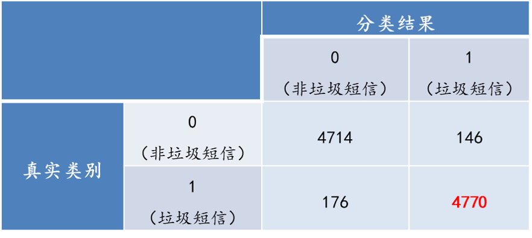

# SpamMessagesClassify
### 数据预处理
* 数据清洗
  去重；去除标记的脱敏数据（x）
* 分词
* 停用词过滤
* 绘制词云

### 文本的向量表示
* one-hot
从非结构化数据到结构化数据转化
将每个词表示为一个长长的向量，词袋：所有词的不重复构成
[a, ate, cat, dolphin, dog, homework, my, sandwich, the]
文本1：My dog ate my homework.
文本2：My cat ate the sandwich.
文本3：A dolphin ate the homework.
[a, ate, cat, dolphin, dog, homework, my, sandwich, the]
a：[1 0 0 0 0 0 0 0 0]
ate：[0 1 0 0 0 0 0 0 0]
文本转化为词向量矩阵
[a, ate, cat, dolphin, dog, homework, my, sandwich, the]
文本1：[0 1 0 0 1 1 1 0 0]
文本2：[0 1 1 0 0 0 1 1 1]
文本3：[1 1 0 1 0 1 0 0 1]
缺陷：忽略了句子词频信息

* TF－IDF权重策略
文本1：My dog ate my homework.
文本2：My cat ate the sandwich.
文本3：A dolphin ate the homework.
增加词频信息
文本1：[0 1 0 0 1 1 2 0 0]  “my”在句子中出现了2次
文本2：[0 1 1 0 0 0 1 1 1]
文本3：[1 1 0 1 0 1 0 0 1]
归一化：避免句子长度不一致问题，即文档TF信息
文本1：[0 1/5 0 0 1/5 1/5 2/5 0 0]  “my”在句子中出现了2次
文本2：[0 1/5 1/5 0 0 0 1/5 1/5 1/5]
文本3：[1/5 1/5 0 1/5 0 1/5 0 0 1/5]
权重策略文档中的高频词应具有表征此文档较高的权重，除非该词也是高文档频率词
TF：Term frequency即关键词词频，是指一篇文档中关键词出现的频率 
IDF：Inverse document frequency指逆向文本频率，是用于衡量关键词权重的指数
TF = N / M， 其中N：单词在某文档中的频次，M：该文档的单词数
IDF = log(D / D_{w})，其中D：总文档数，Dw：出现了该单词的文档数
TF-IDF = TF*IDF

### 朴素贝叶斯
原始的朴素贝叶斯只能处理离散数据

* 高斯朴素贝叶斯——当变量为连续变量可使用
import numpy as np 
X = np.array([[-1, -1], [-2, -1], [-3, -2], [1, 1], [2, 1], [3, 2]]) 
Y = np.array([1, 1, 1, 2, 2, 2]) 
from sklearn.naive_bayes import GaussianNB 
clf = GaussianNB() 
clf.fit(X, Y) 
\#GaussianNB 类构造方法无参数，属性值有： 
 class_prior_ #每一个类的概率 
 theta_ #每个类中各个特征的平均 
 sigma_ #每个类中各个特征的方差
注：GaussianNB 类无score 方法 

* 多项式朴素贝叶斯——用于文本分类 
import numpy as np 
X = np.random.randint(5, size=(6, 100)) 
y = np.array([1, 2, 3, 4, 5, 6]) 
from sklearn.naive_bayes import MultinomialNB 
clf =MultinomialNB(alpha=1.0 #平滑参数 
 , fit_prior=True #学习类的先验概率 
 , class_prior=None) #类的先验概率 
clf.fit(X, y)

### 模型结果
训练时，让让两个CountVectorizer共享vocabulary，使得在train和test上提取的feature维度不同变为相同
cv1 = CountVectorizer(vocabulary=cv.vocabulary_)
cv_test = cv1.fit_transform(x_test) 
print(cv_test.toarray())  # 测试集的文档词条矩阵
\#cv_test、cv_train向量长度应保持一致

得到结果如下：

准确率（93.72%）
精确度（88.61%）
召回率（96.44%）
F1值（0.9602）
即，可以有效识别垃圾短信。

